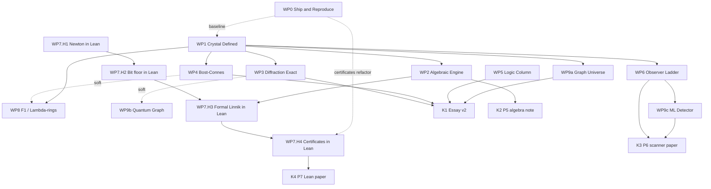

# The Crystal Programme

**From essay to formal object: a programme of work.**
Status: draft v0.1 for discussion — 2026-08-03.

---

## 0. What this is

One object — the multiplication crystal, formally the measured free monoid `(N^×, log)` — currently
probed by four draft papers and five scripts:

| Asset | Role |
|---|---|
| `papers/u_space_prime_formula_paper.tex` (Companion I) | integer moment channel (Linnik engine) |
| `papers/prime_ladder_paper.tex` (Companion II) | weighted moment channel (Chebyshev ladder) |
| `papers/prime_recovery_paper.tex` (Companion III) | decoding + bit-floor obstruction |
| `papers/multiplication_crystal_paper.tex` (Essay) | the view from above |
| `code/` (five scripts; entry point `run_all.py`) | machine verification |

Canonical sources were established by the WP0 version audit; see `papers/PROVENANCE.md`.
Superseded copies remain untracked in `Draft II/`, `Finals/`, `The Crystal/`, and the repo root.

The programme's goal: **every claim in the series lands in exactly one of three states** —
(i) an *adopted theorem* with named attribution in an established framework,
(ii) a *machine-verified table* reproducible by one command, or
(iii) an *explicitly labeled conjecture* equipped with its falsification protocol.

The nine formalization routes identified in the 2026-08-03 session map onto work packages as follows:
R1 axiomatization → WP1 · R2 incidence algebra/species → WP2 · R3 Bost–Connes → WP4 ·
R4 crystalline measures → WP3 · R5 disjointness ladder → WP6 · R6 logic column → WP5 ·
R7 F₁/Λ-rings → WP8 · R8 Lean → WP7 · R9 new universes/instruments → WP9a/b/c.

---

## 1. Ordering principles

The dependency order below follows from seven principles; when in doubt, they decide.

- **P1 — Ship before you improve.** A public, reproducible baseline (repo + arXiv) comes first:
  it establishes priority, makes every later WP a diff against a citable object, and forces the
  reproduction discipline early.
- **P2 — Define before you formalize.** The crystal must be a *definition* (WP1) before any chapter
  can become a *theorem about it*. Doing WP1 first lets WP2–WP4 be stated once at Beurling
  generality (arbitrary length functionals) and specialized to `log p`, instead of restated per universe.
- **P3 — Algebra before mechanization.** Recasting the trilogy's engine as finitary algebra (WP2)
  precedes proving it in Lean (WP7.H3): proof assistants eat formal Dirichlet series for breakfast
  and choke on contour integrals.
- **P4 — Rigor before new science.** Chapters whose vocabulary currently outruns their footing
  (diffraction §4 above all) get fixed before new experiments cite them.
- **P5 — Lean is a lane, not a phase.** Two Lean targets are mathlib-ready today (Newton recovery,
  bit floor); the lane starts at Phase 1 and runs continuously, staging harder targets as their
  prerequisites land.
- **P6 — Frontier last.** The F₁ / arithmetic-site material is reading-heavy and low-falsifiability;
  it must never block executable work.
- **P7 — Every WP exits through the audit ladder.** The essay's own six-stage pipeline
  (artifact → entanglement → skeleton-derivable → known theorem → candidate; then librarian and
  adversary) is the programme's exit review. A WP is done when its claims survive the ladder and
  carry one of the three claim-states above.

---

## 2. Work-package map

Sizes: **S** = 1–3 working sessions · **M** = roughly a week of sessions · **L** = standing lane.
Hard deps block start; soft deps only shape the write-up.

| WP | Name | Hard deps | Soft deps | Size | Phase | Headline deliverable |
|---|---|---|---|---|---|---|
| WP0 | Ship & Reproduce | — | — | M | 0 | public repo, trilogy on arXiv, one-command reproduction |
| WP1 | The Crystal, Defined | — | WP0 | S | 1 | definitions note; essay §2 rewritten against it |
| WP2 | The Algebraic Engine | WP1 | — | M | 1 | formal-log theorem; bijection or documented obstruction; P5 note |
| WP7 | Lean Lane (H1→H4) | staged (see §3) | — | L | 1–4 | compiled Lean artifacts in CI; P7 paper |
| WP9a | The Graph Universe | WP1 | — | S | 1 | Ihara/Ramanujan dictionary column, machine-checked |
| WP3 | Diffraction, Stated Exactly | WP1 | — | M | 2 | essay §4 v2 as a distributional identity + autocorrelation table |
| WP4 | Symmetry Breaking, Literally | WP1 | — | M | 2 | essay §§3/5 v2 on Bost–Connes; Hagedorn reading of ρ |
| WP5 | The Logic Column | — | WP1 | S | 2 | decidability trichotomy section + solver demos |
| WP6 | The Observer Ladder | WP1 | — | M–L | 3 | two-skeleton conjecture v2, scanner v2, preregistration registry |
| WP9b | Quantum-Graph Instrument | — | WP3 | M | 3 | log-p quantum graph, trace-formula demo |
| WP9c | ML Detector | WP6 | — | M | 3 | preregistered nonlinear scan report |
| WP8 | The Frontier Door | WP1 | WP4 | M | 4 | Λ-ring/F₁ section; Fermat-as-Frobenius-lift demo |
| WP10 | Releases | rolling | — | — | all | K1–K4 (see §5) |

---

## 3. Work-package details

### WP0 — Ship & Reproduce
**Goal.** Freeze a public, reproducible baseline before anything is improved.
**Tasks.**
- `git init`; create the GitHub repo; commit code + papers; choose license (MIT for code, arXiv license for text).
- Fill every placeholder: author name in the trilogy (essay already says Carl Gribble), repo URL in all four `\bibitem{Code}` entries, arXiv IDs as they issue.
- `run_all.py` (or `make all`): regenerates **every numerical table in all four papers** from scratch; pin `mpmath`/`numpy` versions; record runtimes.
- Small fixes found in review: recount the "forty exact interval tests" claim in Companion I (enumeration reads 39); decide arXiv categories (trilogy → `math.NT`; essay → `math.HO` cross `math.NT`).
- Post the trilogy. **Hold the essay** until M2 (its §4 vocabulary gets fixed by WP3 first — P4).
**Done when.** Repo is public; trilogy has arXiv IDs; one command reproduces every table; README maps papers ↔ scripts.
**Risk.** Scope creep into rewriting. Mitigation: WP0 changes text only where a placeholder or a counted error demands it.

### WP1 — The Crystal, Defined
**Goal.** Replace the metaphor with a definition the rest of the programme quantifies over.
**Tasks.**
- Define a **measured free monoid** ("crystal"): pair `(M, ℓ)`, `M` free commutative on countably many generators, `ℓ : M → R₊` additive, with finite counting function `N_ℓ(x) = #{m : ℓ(m) ≤ x}`.
- Define the invariants each chapter computes: the *shadow* (image measure of counting under ℓ), the *tower series* and its abscissa (dimension), the *diffraction pair* (autocorrelation, FT), the *symmetry data* (Aut of the pair vs Aut of M).
- Instances table: integers (`ℓ = log p`), function fields (`ℓ = deg·log q`), Beurling systems (arbitrary ℓ — cite Beurling, Diamond–Zhang), graphs (preview of WP9a).
- Rewrite essay §2 against the definition; mark which later sections become invariant statements.
**Done when.** A 4–6 pp definitions note exists (candidate standalone: *"Crystals and their shadows"*); the essay's dictionary table is re-captioned as one functor evaluated at three objects.
**Feeds.** Everything; specifically the Beurling-generality statements of WP2–WP4.
**Key reading.** Beurling (1937); Diamond–Zhang, *Beurling Generalized Numbers* (2016).

### WP2 — The Algebraic Engine
**Goal.** Companion I's identity system restated as exact algebra — no limits, no analytic ζ.
**Tasks.**
- State and prove: Linnik's identity is the **formal logarithm in Rota's reduced incidence algebra** of the divisor poset (≅ ring of formal Dirichlet series); the `S_j` system is a family of identities in that ring, valid for any crystal in the WP1 sense.
- Categorify one floor: the layer structure `T_k` as the **arithmetic product of species** (Maia–Méndez); identities as species isomorphisms where they hold.
- Hunt a **sign-reversing involution** proving the duplicated-mass theorem bijectively; if none is found, document the obstruction honestly (that is itself a finding).
- Machine checks: extend the `dconv` truncation checks in `crystal_demos.py` to the formal-ring statements at Beurling generality (random length systems).
**Done when.** The formal-log theorem has a complete elementary proof at crystal generality; bijection found or obstruction recorded; Companion I revision plan written.
**Deliverable.** P5 note (working title: *"The multiplication crystal's engine is a formal logarithm"*), or a new section of Companion I v2.
**Feeds.** WP7.H3 (this is the statement Lean will prove); essay §3 pointer.
**Key reading.** Rota (1964); Doubilet–Rota–Stanley on incidence algebras; Maia–Méndez, *arithmetic product of species* (2008).

### WP3 — Diffraction, Stated Exactly
**Goal.** Essay §4 upgraded from numerics-plus-analogy to a theorem in mathematical diffraction theory.
**Tasks.**
- Adopt the Hof/Baake–Grimm framework: weighted Dirac combs, autocorrelation, diffraction measure.
- State the honesty fix explicitly: neither the log-shadow of N nor the primes is Delone/Meyer (gaps), so the rigorous objects are **weighted combs**, and the rigorous statement is **Guinand–Weil as an identity of tempered distributions** (the Λ-weighted log-prime comb and the zero comb are FT pairs).
- Frontier subsection, all claims labeled: crystalline measures and Fourier quasicrystals (Kurasov–Sarnak Lee–Yang constructions; Olevskii–Ulanovskii; Meyer); where RH enters.
- Machine demo v2: compute the Hof autocorrelation of the truncated log-comb and compare with theory; keep the existing peak-scan as the "experimental" companion to the now-exact statement.
**Done when.** §4 v2 contains zero informal uses of "quasicrystal"; one new machine table (autocorrelation vs theory); frontier claims carry citations or CONJECTURE labels.
**Feeds.** WP9b; essay v2 (K1).
**Key reading.** Baake–Grimm, *Aperiodic Order* I; Kurasov–Sarnak (2020); Meyer on crystalline measures.

### WP4 — Symmetry Breaking, Literally
**Goal.** The essay's central metaphor becomes a citation to a theorem.
**Tasks.**
- Exposition of the **Bost–Connes system** scoped to machine-checkable content: partition function ζ(β); KMS_β classification; the symmetry that breaks is the profinite point group (Gal(Q^ab/Q)) — exactly the essay's chapter-5 objects.
- **Hagedorn reading of ρ**: the tower partition function is `1/(2 − ζ(β))`; Kalmár's ρ is its divergence temperature. Connect to the §3 table; add a phase-diagram machine table (free vs tower gas).
- Rewrite essay §§3/5 phrases "symmetry-breaking field" and "the weld" to point at the rigorous home; keep the poetry, add the address.
**Done when.** §§3/5 v2 drafted; KMS/Hagedorn table reproduces under `run_all`; claims/non-claims paragraph present (no operator-algebra proofs claimed as ours).
**Feeds.** WP8 (BC is Connes–Consani's door); essay v2 (K1).
**Key reading.** Bost–Connes (1995); Julia, *primon gas* (1990); Connes–Marcolli chapters on BC.

### WP5 — The Logic Column
**Goal.** The weld as a formal theorem-triple; a logic column in the dictionary.
**Tasks.**
- Exposition: bare crystal `(N, ×)` = **Skolem arithmetic, decidable**; bare ruler `(N, +)` = **Presburger, decidable**; the weld `(N, +, ×)` = **undecidable**. The essay's "undecidability of the weld" line gets its precise statement and citations.
- Reverse-math notes: record which trilogy theorems are finitary/elementary (most identities) vs which need analysis, at the level of a table, not new proofs.
- Demos: run an SMT/Presburger solver on ruler questions; a decision-procedure toy on a finite crystal patch.
- Optional stretch: Büchi arithmetic and automatic structures as the bridge to WP6's automatic-sequence stratum.
**Done when.** New short essay section + demo script; dictionary gains the logic row/column.
**Key reading.** Skolem (1930); Presburger; Bès's survey of decidability in arithmetic.

### WP6 — The Observer Ladder
**Goal.** The two-skeleton conjecture stratified by observer complexity, with theorem base camps; the scanner upgraded to match.
**Tasks.**
- Define **observer classes** on crystal-native invariants: automatic sequences; AC⁰; zero-entropy dynamical observers; polynomial-time. Restate the conjecture as "no correlation beyond skeleton, per class."
- Base-camp table (theorems, not aspirations): Möbius ⊥ automatic sequences (Müllner; Mauduit–Rivat for digits); Möbius ⊥ AC⁰ (Green); logarithmic Sarnak/Chowla partial results (Frantzikinakis–Host; Tao's two-point log-Chowla).
- Scanner v2: add **positive controls drawn from the theorem strata** (they must fire as "known"); keep skeleton-nulls; keep Bonferroni + holdout.
- **Preregistration registry**: commitments (feature battery, thresholds, predictions) committed to the repo with hashes *before* runs; results append-only.
**Done when.** Conjecture v2 stated per-class; scanner v2 first-light report written under the registry discipline.
**Feeds.** WP9c; P6 paper (K3).
**Key reading.** Sarnak's three lectures; Müllner (2017); Green (2012); Mauduit–Rivat (2010); Tao (2016).

### WP7 — Lean Lane (standing)
**Goal.** "Certified crystallography" upgraded from library-trust to kernel-trust.
**Stages and their deps.**
- **H1 (Phase 1, deps: none).** Companion III Theorem 1 (Newton-identities recovery) in Lean 4 — mathlib has Newton's identities; the theorem is elementary symmetric-function algebra plus "monic integer polynomial of degree r has ≤ r integer roots."
- **H2 (Phase 1, deps: none).** The bit-floor obstruction theorem — pigeonhole plus binomial estimates; small.
- **H3 (Phase 3, deps: WP2).** The formal-Dirichlet-series Linnik identity and the `S_j` system's correctness *as formal algebra* — prove exactly WP2's statement, not the analytic one.
- **H4 (Phase 4, deps: WP0 refactor; stretch).** Certificate pipeline for Companion II: refactor `certified_snap.py` to *emit rational interval certificates*; write the Lean checker that re-verifies the sandwich inequalities from the certificate. CoqInterval-style; hardest item in the programme.
**Done when (per stage).** Lean files compile in repo CI. Final deliverable: P7 artifact paper (K4).
**Risk.** H4 may exceed available effort — it is explicitly severable; P7 stands on H1–H3.

### WP8 — The Frontier Door
**Goal.** The final thesis ("one dial: characteristic zero") housed in the F₁ frameworks built for it.
**Tasks.**
- Exposition: crystal as monoid scheme over F₁ (Deitmar; Toën–Vaquié; Connes–Consani); the weld as base change `−⊗_{F₁} Z`.
- **Borger's reading**: Λ-ring structure = commuting Frobenius lifts = what survives of Frobenius in characteristic zero; on Z the Frobenius-lift condition *is* Fermat's little theorem. Machine demo: Witt/ghost coordinates; verify the Λ-axioms numerically.
- Arithmetic-site section v2: the door §7 of the essay ends at, now with the BC bridge from WP4; everything labeled as reading, no new claims.
**Done when.** Essay final-section v2 + Witt demo under `run_all`; librarian pass confirms zero unlabeled speculation.
**Key reading.** Borger, *Λ-rings and the field with one element* (2009); Deitmar; Connes–Consani (2014).

### WP9a — The Graph Universe
**Goal.** A third dictionary column that is finite and fully checkable.
**Tasks.** Ihara zeta via the Bass formula; **RH for the Ihara zeta ⇔ Ramanujan graph** (theorem); machine check on explicit graphs (small regular graphs; an LPS Ramanujan graph if convenient); add the column to the dictionary with the same row structure as F_q[t].
**Done when.** Column verified by script; one paragraph in the mirror section.
**Key reading.** Terras, *Zeta Functions of Graphs*.

### WP9b — Quantum-Graph Instrument
**Goal.** The closest legal thing to a Hilbert–Pólya bench experiment.
**Tasks.** Build a quantum graph with edge lengths `log 2, log 3, log 5, …` (finite truncation); compute its spectrum numerically; exhibit the trace formula's length spectrum = crystal points; relate to WP3's crystalline-measure frontier (Kurasov's school). Honest framing: an *instrument demo*, not an RH approach.
**Done when.** Demo + section, with a negative-control graph (wrong lengths) showing the crystal signature disappear.

### WP9c — ML Detector
**Goal.** Extend the scanner from linear correlations to nonlinear observers, same discipline.
**Tasks.** Baselines that only see skeleton data vs models that see crystal-native features; preregistered features, holdout halves, audit ladder for any win; interpretability pass to extract any surviving feature into a candidate statement (which then enters the WP6 pipeline at stage 1).
**Done when.** Scan report filed in the registry (an all-null harvest is a publishable outcome inside P6).

### WP-RH — The Positivity Lane (standing; opened 2026-08-07)
**Goal.** The explicit-formula functional treated as the object of study: RH is
equivalent (Weil 1952) to positivity of `W(g * g~)` over all admissible test functions —
the criterion whose analogue carries every proved case (Castelnuovo positivity for function
fields; spectral realization for graphs and the modular surface). The lane measures the
positivity landscape and the structures that enforce it, under the registry discipline.
The words "proof of RH" appear in no artifact of this lane; milestones are priced honestly
(instrument + calibration: near-certain; novel tables + labeled conjectures: likely; a
partial theorem: possible; RH: epsilon).
**Stages.**
- **RH1 (done, first light).** The Weil form as a Gram matrix on a preregistered Gaussian
  family, geometric side vs zero side; prime-free-window row; elliptic-curve calibration
  with Hasse-violating negative control. Instrument: `code/weil_positivity.py`.
- **RH2 (done, first light).** Inverse spectral both ways: discrete Krein/Jacobi data from
  the zeros with density-matched controls, and the closed-form semiclassical (arithmetic-
  free) potential solved forward — its spectral residual measured to be the prime comb.
  Instrument: `code/canonical_system.py`.
- **RH3 (done, first light).** The requirements spec as a machine-checked matrix — 8
  properties x 3 universes, every cell ADOPTED/MACHINE/MEASURED, exactly one OPEN cell
  (self-adjoint realization, zeta), with two measured constraint lines pinned on its
  occupant. Instrument: `code/requirements_spec.py`.
- **RH3b (done).** The two-interval plateau earned out of sample (post-hoc reading refused
  claim status, converted to a prereg on fresh truncations, confirmed): the reconstruction's
  leading structure is the arithmetic-free equilibrium of the gap. Instrument:
  `code/two_interval_plateau.py`. First-light phase consolidated as **Programme Note 4**
  (`papers/positivity_lane.tex`; compiles clean — pdflatex ×2, zero warnings, no undefined
  references; cite cross-check 33/33 both directions).
**Risk.** The lane is adjacent to an active literature (Connes–Consani Weil positivity;
Li coefficients; de Branges spaces) — librarian stage applied without mercy to any
candidate; heavy prior-art presumption.

### WP10 — Releases (rolling)
- **K1** Essay v2 → arXiv (gate: WP3 + WP4 + WP5 + WP9a merged; pointers to WP2/WP6).
- **K2** P5 algebra note (gate: WP2).
- **K3** P6 scanner/ladder paper (gate: WP6 + WP9c; WP9b optional inclusion).
- **K4** P7 Lean artifact paper (gate: WP7.H1–H3; H4 if achieved).
- Trilogy v2s as upstream WPs land (Companion I ← WP2; Companion II ← WP7.H4; Companion III ← WP7.H1/H2 citations).

---

## 4. Phases and milestones

| Phase | Contents | Milestone (exit criterion) |
|---|---|---|
| 0 — Ship | WP0 | **M0**: repo public, trilogy on arXiv, `run_all` green |
| 1 — Spine | WP1, WP2, WP7.H1–H2, WP9a | **M1**: definitions note frozen; formal-log theorem proved; first Lean files compile; graph column checked |
| 2 — Rigor | WP3, WP4, WP5 | **M2**: essay v2 on arXiv (K1) |
| 3 — Science | WP6, WP9b, WP9c, WP7.H3 | **M3**: ladder conjecture v2 + scanner v2 first-light report; P6 draft (K3) |
| 4 — Frontier & capstone | WP8, WP7.H4 | **M4**: frontier section labeled and demoed; **M5**: kernel-checked certificates or documented retreat; P7 (K4) |

Within a phase, WPs are parallel. Phases gate on milestones, not calendars.

---

## 5. Dependency graph

**Critical path (longest chain):** WP1 → WP2 → WP7.H3 → WP7.H4 → K4.
**Shortest path to a visible win:** WP0 → M0 (trilogy public), then WP1 + WP7.H1 in parallel.
**Essay v2 path:** WP1 → {WP3, WP4, WP5, WP9a} → K1; nothing on the Lean lane gates it.

---

## 6. Risk register

| Risk | Hit | Mitigation / fallback |
|---|---|---|
| WP2 bijective proof doesn't exist or resists | Medium | Formal-log theorem alone suffices for H3 and P5; record the obstruction as a finding |
| WP3 overclaims in crystalline-measure territory | Medium | Adopt Baake–Grimm definitions verbatim; every frontier sentence carries a citation or CONJECTURE label |
| WP4 drifts into operator-algebra depth beyond scope | Medium | Scope fence: only numerically checkable statements (partition functions, explicit KMS at β>1); the rest is attributed exposition |
| WP7.H4 too hard for available effort | High | Severable by design; P7 stands on H1–H3; document the retreat |
| WP6 observer classes defined too loosely to falsify | Medium | Each class gets a machine-checkable membership test before the conjecture is restated over it |
| Scanner false positives / garden of forking paths | Low (discipline exists) | Registry with pre-committed predictions and hashes; Bonferroni; holdout; audit ladder |
| Solo author + AI blind spots | Standing | Librarian + adversary stage per WP exit; AI-disclosure sections maintained; external expert eyes invited at M1 and M2 |

---

## 7. Governance and working agreements

1. **Reproduction:** `run_all.py` regenerates every table in every paper; CI runs it; a table not
   reproduced by CI does not appear in a paper.
2. **Claims taxonomy:** every mathematical sentence in the series is one of
   `ADOPTED(citation)` / `MACHINE(table id)` / `CONJECTURE(label + falsification protocol)`.
3. **Preregistration:** scans and ML runs commit their battery, thresholds, and predictions to the
   registry before measurement; results are append-only.
4. **Exit review:** each WP closes with the six-stage audit ladder, ending in librarian
   (prior-art hunt, applied without mercy) and adversary (strongest objection, written down).
5. **Versioning:** papers carry vN in-file; PROGRAMME.md is the single source of truth for status;
   each WP gets a `status:` line here as it moves (todo → active → review → done).
6. **Autonomous cadence:** work proceeds one WP at a time. At each WP exit: changes committed and
   pushed, the status-ledger row updated with the outcome, and a chat summary posted — then pause
   for direction before the next WP begins. Mid-WP interruptions only for genuine blockers or scope
   changes.

---

## 8. Session-zero checklist (start here)

1. **WP0:** `git init` + GitHub repo + `run_all.py` skeleton; fill `[Author Name]` and repo-URL
   placeholders; recount the forty-tests claim; draft arXiv metadata for the trilogy.
2. **WP1:** draft the definitions note (the whole programme quantifies over it).
3. **WP7.H1:** create the Lean project, import mathlib, state the Newton-recovery theorem; even a
   `sorry`-free statement file is a real first artifact.

Status ledger:

| WP | Status |
|---|---|
| WP0 | **done** 2026-08-03 — version audit + canonical `papers/`+`code/` (provenance recorded); attribution + AI disclosures in all four papers; cite cross-check clean; full `run_all.py` verification green (Paper 1 40/40, Papers 2–3 exact, essay tables + scanner reproduce); repo public at `github.com/carlgribble-caa/prime-moments`; **trilogy published on Zenodo** (CC BY 4.0, ORCID-linked): `10.5281/zenodo.21769103` / `21769105` / `21769107`, DOIs cross-filled in all papers and the submission pack. arXiv can follow later as record versions if endorsement materializes. → M0 achieved; Phase 1 unblocked |
| WP1 | **done** 2026-08-03 — Programme Note 1 (`papers/crystals_and_shadows.tex`, compiles clean): crystal = measured free monoid (= Knopfmacher's arithmetical semigroup additively, Beurling in monoid form — attribution explicit); finiteness lemma; length multiset proved a complete isomorphism invariant; invariant package defined (ζ_C/partition fn, layers + tower exponent ρ_C via ζ_C=2 with existence/uniqueness proof, universal Linnik detector stated for WP2, shadow/prime combs for WP3, Aut(C), lattice dichotomy); instances table (ℤ, F_q[t], Beurling, graph preview); "symmetry asymmetry" remark — Aut(C_ℤ)=1 already at the measured-crystal level vs Aut(C_F_q[t]) = ∏ Sym(I_n) ⊇ substitutions. Essay §2 + mirror table now cite the note; who-consumes-what section maps invariants → WPs |
| WP2 | **done** 2026-08-03 — Programme Note 2 (`papers/formal_logarithm.tex`, compiles clean): formal-log theorem proved at crystal generality (κ = log ζ in the convolution algebra, supported on axis powers with value 1/j — unique factorization + exp/log calculus of a complete filtered ℚ-algebra, zero analysis); corollaries recover Companion I's Lemma 1, the window pairings behind the T/S system (formal explanation of the denominator-1 exactness), and the duplicated-mass skeleton. Möbius twin Λ = ℓ∗μ derived by the derivation identity in two lines, with the classical toggle involution = full bijective proof. Involution hunt outcome (honest): obstruction recorded — κ non-integer ⇒ no unweighted involution; Burnside reformulation (1/k = orbit-size corrections under cyclic rotation, micro-checked) stated as the open **necklace question**; species categorification scoped as a pointer (Maia–Méndez). Machine checks `code/formal_engine.py` in run_all: 13/13 PASS incl. basis-vector trick covering all Beurling length systems at once. Companion I revision plan written (§8, queued for K1). → **WP7.H3 unblocked** |
| WP3 | **done** 2026-08-03 — Essay §4 rewritten as exact mathematics: Hof/Baake–Grimm frame adopted; honesty clause stated in §2 and §4 (the bare shadows are not Delone ⇒ not model sets; the weighted combs are the objects); **Guinand–Weil displayed as the unconditional pairing identity** with new machine table (`code/diffraction_pairing.py`, in run_all): six Gaussian test centres verified to ~1e-23/-24, including t₀ = 0 where the pole term 4e^(1/8) cancels exactly against archimedean + prime terms (the old "bulk subtraction" now a derivation) and a between-zeros centre matched equally (identity, not fit). Frontier paragraph with labels: crystalline measures / Fourier quasicrystals defined (Meyer, Lev–Olevskii), rigidity + Lee–Yang existence cited as theorems (Kurasov–Sarnak), RH labeled conjecture, zero-comb characterization labeled open; quantum-graph hook to WP9b. Zero informal "quasicrystal" uses remain (6 occurrences, all formal/attributed). 7 new bibitems; cite-check 52/52; recompiles clean |
| WP4 | **done** 2026-08-03 — the symmetry-breaking metaphor now has its address, machine-witnessed (`code/primon_gas.py`, in run_all, 2 s, all PASS): (1) free gas = Julia's primon gas, −ζ'/ζ mean-energy identity checked to 1e-11; (2) **Hagedorn reading of ρ**: tower gas Z = 1/(2−ζ(β)) diverges at β = ρ = 1.728647238998184; thermal sums of exact K(n) to 10^6 match with deficits equal to the y^ρ density-law prediction at ratios 0.999–1.000; pole residue 1/(−ζ'(ρ)) = 0.5500 = ρ·C ties thermodynamics to the §3 counting constant; tower masses cross-check the essay's table (48,614 / 2,602,393); (3) **Bost–Connes order parameter** via Hurwitz zetas: frozen KMS_∞ values = roots of unity (1e-18), Galois orbit at clock 5 = the four primitive fifth roots, |φ| falls 1.000 → 0.0076 as β: ∞ → 1.01 (symmetry restoration at the transition). Essay §3 gains the Hagedorn paragraph, §5 the BC paragraph with real numbers, §8 credits Julia + Bost–Connes; claims/non-claims explicit (classification theorems cited, not reproved). Cite-check 54/54; recompiles clean. ("The weld" pointer deferred to WP5's logic column, as planned) |
| WP5 | **done** 2026-08-03 — the weld as a theorem-triple with the machine walking all three (`code/logic_column.py`, in run_all, <1 s, all PASS): (1) ruler decidable (Presburger) — Frobenius frontiers decided then brute-force-confirmed (169 for 6x+35y, 493 for 20x+27y, no-frontier for gcd>1); (2) crystal decidable (Skolem, axiswise) — ∃x,y: x^i = c·y^j decided per-prime, √2's irrationality proved mechanically by one exponent's parity, witnesses constructed for solvable cases; (3) weld undecidable (Gödel–Church), fatal already with successor: J. Robinson's definitional identity verified at all 226,981 triples ≤ 60. Essay §5 gains "The logic of the weld" block; mirror dictionary gains the logic row with the R. Robinson caveat (the wildness is the weld's, not the lengths'); §8's inexhaustibility line gets its citations; stale \thanks Section~7→10 ref fixed. Reverse-math ledger of the trilogy printed by the script. 6 new bibitems; cite-check 60/60. **Phase 2 complete → essay v2 ready → M2/K1 gate open** |
| WP6 | todo |
| WP7 | **H1 done** 2026-08-03 — `lean/` project (Lean v4.32.2 + mathlib v4.32.2, elan installed, 6.2 GB cache): `PrimeMoments/NewtonRecovery.lean` kernel-checks Companion III Theorem 1 uniformly over integer configurations — `recoveryPoly` monic of degree #S; Vieta both forms (`recoveryPoly_coeff`, `recoveryPoly_eq_sum` via `Multiset.prod_X_sub_C_coeff`); `newton_recursion` (division-cleared paper recursion, specialized from mathlib's `MvPolynomial.mul_esymm_eq_sum` by `aeval` at the configuration); `isRoot_recoveryPoly_iff` + `recovery_eq_filter` (P(W) = window roots). `lake build` green; `#print axioms` = {propext, Classical.choice, Quot.sound} on all five theorems. **H2 done** 2026-08-03 — `PrimeMoments/BitFloor.lean`: Definition 1 (UniformScheme: encode/decode with length bound and round-trip law) + Theorem 3 in three forms — `choose_le` (C(m,r) ≤ 2^(D+1)−1, the paper's exact count via a sentinel-digit injection `bitCode : List Bool ↪ ℕ` landing in Ico 1 (2^(D+1))), `choose_lt` (display form), `logb_bound` (D ≥ log₂ C(m,r) − 1 over ℝ). Window modeled as Fin m — cardinality-only, matching the paper's uniformity model. Build green, zero warnings, axioms = standard trio. Next: H3 (formal Linnik, unblocked by WP2), H4 (certificate checking, stretch) |
| WP8 | **done** 2026-08-03 — the frontier door, scoped as planned (reading + demo + labels, no new claims): essay's final-thesis section gains the Borger reading (the integers' canonical λ-ring structure = commuting Frobenius lifts; the defining congruence ψ^p(n) ≡ n^p mod p **is Fermat's little theorem** — characteristic zero retains the Frobenius's shadow, and Borger proposes it as the descent datum to the absolute point); `code/witt_frobenius.py` (in run_all, <1 s, all PASS) verifies the shadow is load-bearing — Fermat on a patch, W₂ ghost-homomorphism at five primes, W₃ divisions by p and p² clearing at three primes on random big integers. Connes–Consani arithmetic-site door already cited at §7's end; Borger bibitem added; cite-check 66/66 |
| WP9a | **done** 2026-08-03 — `code/graph_universe.py` (in run_all): the graph crystal audited exactly on five 3-regular graphs — geodesic counts from the Bass determinant == Hashimoto nonbacktracking traces integer-for-integer to length 12; Euler product over primitive geodesic classes (Möbius-inverted from N_m) rebuilds the determinant exactly (the free monoid verified directly); RH ⇔ Ramanujan exercised in **both directions** (K4/K33/Q3/Petersen on the critical circle to 1e-16; CL16 spectral radius 2.8478 > 2√2 with poles 8.8e-2 off); tower exponents ρ_C computed per graph (Note 1 invariant). Essay mirror section gains the third-universe paragraph + Ihara/Bass/Terras/LPS citations; recompiles clean, cite-check 45/45. **Phase 1 complete → M1 achieved** |
| WP9b | **done** 2026-08-03 — `code/quantum_graph.py` (in run_all): star quantum graph with edge lengths log 2/log 3/log 5; 3,240 eigenvalues to k = 3000 (Weyl slope 1.08036 vs L/π = 1.08263, 0.2%); the length spectrum's every detected peak lands at 2 log n for 5-smooth n — squarefree orbits 2,3,5,6,10 all present, repeated-bounce orbits (4, 9, 12) present and correctly 1/r-suppressed; negative-control graph rejects the crystal template 56.5 : 1.8. Two instrument bugs found and fixed during bring-up (pole guard phase error producing exactly 2× Weyl; sidelobes counted as peaks) — criteria recalibrated to the corrected physics, honest note in script header. The crystal realized as the length spectrum of an actual differential operator (Kurasov–Sarnak adjacency noted; essay §4 frontier already points here) |
| WP9c | **done** 2026-08-03 — `code/ml_detector.py` (in run_all, 45 s) under prereg `3a52d21`: predict next-prime chi4 and large-gap from a congruence-skeleton baseline vs a crystal-native challenger; logistic + boosted stumps (numpy only), chronological holdout, eps = 0.002 nats. **Q1 PASS** (max improvement +0.00022, order below eps, all four task/model combos), **Q2 PASS** (positive control: baseline beats coin by 0.0235 nats — LOS visible to the detector in the skeleton features), Q3 not triggered. Null harvest as predicted; results in registry. Power note honest: the scanner's three in-audit readings (r ≈ 0.02) are below this detector's resolution by design |
| WP10 | rolling |
| WP-RH | **RH1 + RH2 + RH3 + RH3b done; Programme Note 4 drafted** 2026-08-07. **RH3b** under prereg `ee3484d` (`code/two_interval_plateau.py`, in run_all, 4 s, gate T1 PASS): the two-interval law predicted plateaus it had never seen — N = 50: −1.07/−1.75, N = 60: −1.43/−2.79 against ±3, all negative (U1) with odd tighter than even (U2) as committed → the plateau claim earned at MACHINE status; the growing negative bias recorded as observed-but-unclaimed (density-correction prereg candidate). The RH3→RH3b pair (refuted committed window → post-hoc reading refused → out-of-sample prereg → confirmation) recorded as the lane's template for promoting observations to claims. **Note 4** (`papers/positivity_lane.tex`): charter + honest pricing, the three instruments with their refutations as first-class content, the spec matrix, related-work/non-claims, AI disclosure; compiles clean (pdflatex ×2, zero warnings), cite cross-check 33/33 both directions. **RH3** under prereg `8675814` (`code/requirements_spec.py`, in run_all, 9 s, all six gates PASS): the spec matrix printed and complete with exactly one OPEN cell — (self-adjoint realization, zeta). New machine checks: RvM density over 100 zeros (max dev 0.4979, P2 confirmed); rigidity ordering picket < zeros (**var 0.1253**, GUE ~ 0.18, P1 confirmed) < pi-digit Poisson (1.0755); Petersen spectrum↔geodesics via Ihara–Bass exact to 6e-29 for m ≤ 12; the smooth split tr(A^m) = 10·t_m below the girth with **first excess 120 = the pentagons traversed** (the graph miniature of RH2's residual-is-the-primes); fresh EC trace formula at p = 13 over F_169 (180 = 180). Mining redirect recorded in prereg (Jacobi tail limits are truncation-set — PSLQ deferred); P3 tail-identification REFUTED by window choice (committed window sat in the truncation-decay regime; post-hoc plateau n = 11..40 matches the two-interval equilibrium to 1.4 but stays unclaimed) — net: the "tail forgets arithmetic" constraint strengthened. Constraint lines pinned on the OPEN cell: not smooth (prime comb required at fluctuation order) and tight (zero margin in every solved universe). First-light phase of the lane complete. **RH2** under prereg `72d1494` (`code/canonical_system.py`, in run_all, 55 s): (A) Jacobi/Krein data of the zero comb by Stieltjes at dps 40 — symmetry to 9e-37, measure re-derived from J_80 to 1.3e-38; rigidity in Hamiltonian coordinates: std(zeros−smooth)/std(Poisson−smooth) = **0.246** over n = 6..70 (Q2 confirmed; Poisson control deterministic from pi's digits); (B) arithmetic-free canonical object: closed-form Abel-inverted potential (defining property WKB == Nbar+1/8 verified to 5e-5), Numerov spectrum counts exactly 60 below the window, RMS tracking 0.537, and the **headline: detrended residual vs damped prime sum r = 0.9999** — Q1's committed band [0.6, 0.95] refuted *from above*: delta*rho ~ 1/8 − S is numerically an identity, so the smooth Hamiltonian misses exactly the primes and nothing else (no circularity: E_k sees no primes/zeros); Maslov offset measured +0.1251 vs predicted 1/8 (Q3); (C) Frobenius measure reconstruction terminates at step 2, residual 0 — finite exact Hamiltonian where the RH-analogue is a theorem (Q4). Two bring-up bugs (Abel 1/pi prefactor; silent bracket saturation producing constant delta = cap) found by gates B3/B4, fixed with thresholds unchanged, fully recorded in the results file. Classification: known-theorem-derivable mechanism (Wu–Sprung / RvM+WKB); claimed: measured tables, controls, discipline. Requirements spec for RH3 opened (results §Carried forward). **RH1** —  first light under prereg `8252b9a` (`code/weil_positivity.py`, in run_all, 34 s): Gram matrix of the Weil form on 12 even Gaussian profiles assembled from WP3-engine evaluations at 23 grid centres — identity geo-vs-zero to 2.6e-23 across all 78 entries, positivity at lambda_min = -8.5e-24; prime-free window (supp g in (-log2, log2), prime term identically zero) positive at 9.1e-4 with zero-side agreement 4.2e-6 matching the committed tail estimate; EC calibration (y² = x³+x+1 / F_10007, a = -57): Frobenius Toeplitz form PSD of exact rank 2 (~1e-40 floor), Hasse-violating control fires at -38.96 with golden-ratio growth. **Prediction B3 REFUTED and recorded** (registry): the near-kernel is not spanned by gap profiles — measured mechanism: resolved rank of M = 6 = zeros engaged; on a finite spectral window the Weil form is a finite-rank sampler (known-theorem-derivable; kept as calibration, not claimed as novel). Diagonal gap ladder confirmed as committed (rungs 3e-43 → 0.2). Next: RH2 (inverse spectral reconstruction against solved-universe Hamiltonians) |
